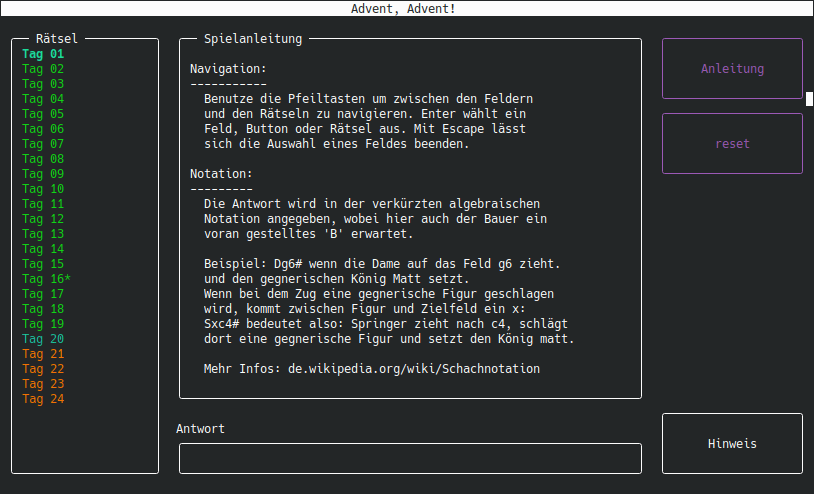

# Schach-Adventskalender

## Installation

Dateien runterladen, z.B. mit `git clone https://github.com/samari-k/Schach-Advent.git` oder als ZIP-Archiv.
Im (nötigenfalls entpackten) Ordner das benötigte Package [py_cui](https://github.com/jwlodek/py_cui) installieren, 
entweder mit `pip install -r requirements.txt` oder mit `pip install py-cui`. 
Starten lässt das Spiel dann im entsprechenden Ordner mit `python advent.py` bzw `python3 advent.py`.

## Benutzung

Die Navigation erfolgt mit der Tastatur. Mit den Pfeiltasten lässt sich zwischen den Widgets (die einzelnen Rahmen) 
hin und her switchen. Zum Auswählen eines Rätsels, Buttons oder des Antwort-Feldes wird Enter gedrückt.
Um die Auswahl des Rätsel- oder Antwort-Feldes aufzuheben wird Escape gedrückt.

Sollte (zum Beispiel bei der Anleitung oder den Schachbrettern) nicht der komplette Text zu sehen sein, muss das 
Terminal-Fenster vergrößert werden.

## Hinweise

Alle Rätsel stammen von [www.schach-tipps.de](https://www.schach-tipps.de/schachtraining/taktik/matt-in-1-zug).  
Informationen zur genutzten Schachnotation gibt es bei [Wikipedia](https://de.wikipedia.org/wiki/Schachnotation#Verk%C3%BCrzte_algebraische_Notation)

Dieser Schach-Adventskalender hat in keiner Weise den Hauch eines Anspruches, in irgendeiner Hinsicht gut zu sein. 
Ich bin weder Programmiererin, noch Schachspielerin. Ersteres macht mir allerdings Spaß und zweiteres macht einem Teil meiner Familie Spaß.
Daher ist dieses kleine Spiel erstens E und T gewidmet, den Schachspielern in meiner Familie, und zweitens dem Discord 
Server der Mathe-/Informatik-Studierenden der Fernuni Hagen, meinem Campus-Ersatz.